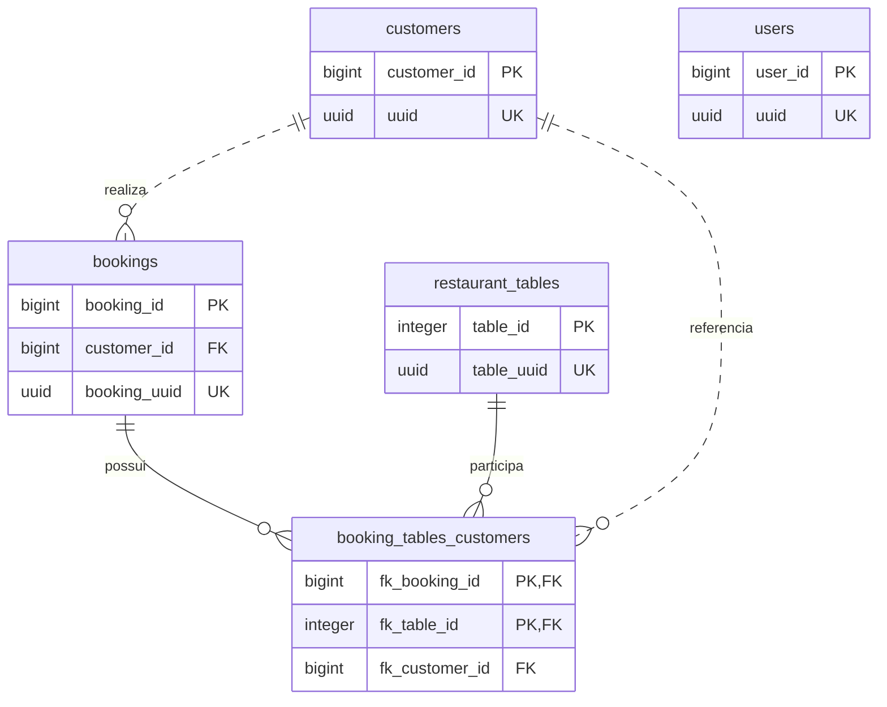

# Banco de Dados — Sistema de Reserva de Mesas de Restaurante

Documentação do esquema PostgreSQL responsável pelo cadastro de mesas, clientes, usuários administrativos e reservas.

> **Fonte de verdade:** [reservation-system.sql](reservation-system.sql). Os tipos, valores padrão e restrições descritos neste documento correspondem ao que o script declara; não representam uma verificação de um banco em execução. As diferenças em relação ao backend estão registradas na seção [Comparação com o backend Java](#comparação-com-o-backend-java).

## Sumário

- [Tecnologia e configuração](#tecnologia-e-configuração)
- [Modelo de dados](#modelo-de-dados)
- [Convenções de leitura](#convenções-de-leitura)
- [Dicionário de dados](#dicionário-de-dados)
- [Integridade referencial e índices](#integridade-referencial-e-índices)
- [Comportamentos e limites do esquema](#comportamentos-e-limites-do-esquema)
- [Comparação com o backend Java](#comparação-com-o-backend-java)
- [Documentação relacionada](#documentação-relacionada)

## Tecnologia e configuração

| Item | Definição no script |
|---|---|
| SGBD | PostgreSQL |
| Banco de dados | `reservation-system` |
| Proprietário | `postgres` |
| Codificação | `UTF8` |
| Localidade | `LC_COLLATE` e `LC_CTYPE`: `pt_BR.UTF-8` |
| Provedor de localidade | `libc` |
| Tablespace | `pg_default` |
| Limite de conexões do banco | `-1` (sem limite específico para o banco) |
| Extensão habilitada | `pgcrypto` |
| Geração de UUID | `gen_random_uuid()` |

O script recria o banco por meio de `DROP DATABASE IF EXISTS` e `CREATE DATABASE`. A instrução `\c "reservation-system"` é um metacomando do **psql** para conectar ao banco recém-criado antes de criar a extensão e as tabelas. A localidade indicada deve estar disponível no servidor.

## Modelo de dados

| Tabela | Responsabilidade |
|---|---|
| `restaurant_tables` | Cadastro das mesas, capacidade, localização e status. |
| `customers` | Cadastro dos clientes e verificação dos meios de contato. |
| `users` | Cadastro dos usuários administrativos. |
| `bookings` | Registro das reservas e do cliente responsável. |
| `booking_tables_customers` | Associação de uma reserva a uma mesa e a um cliente. |

- Cada reserva pertence a exatamente um cliente; um cliente pode ter várias reservas.
- Reservas e mesas possuem uma relação muitos-para-muitos por meio de `booking_tables_customers`.
- Cada registro da associação também referencia exatamente um cliente.
- O esquema permite uma reserva sem mesas associadas; a obrigatoriedade de alocar ao menos uma mesa não é imposta pelas chaves estrangeiras.
- `users` não possui relacionamentos declarados com as demais tabelas.

## Convenções de leitura

- **Permite `NULL`?** informa se a coluna aceita ausência de valor. Colunas de uma `PRIMARY KEY` são implicitamente `NOT NULL` e únicas em conjunto.
- **Padrão / geração** apresenta o `DEFAULT` ou a geração automática definida pelo script. `—` indica ausência de valor padrão explícito.
- **Restrições** apresenta chaves e validações adicionais; a nulabilidade é descrita em coluna própria.
- `SERIAL` e `BIGSERIAL` são abreviações do PostgreSQL para colunas `INTEGER` e `BIGINT`, respectivamente, com geração por sequência. Não são declarações `GENERATED ... AS IDENTITY`.
- `TIMESTAMPTZ` equivale a `TIMESTAMP WITH TIME ZONE`: representa um instante, exibido conforme o fuso da sessão, sem preservar o nome do fuso original.
- Um `DEFAULT` é aplicado quando a coluna é omitida na inserção ou quando se utiliza `DEFAULT`; ele não substitui um `NULL` explícito.

## Dicionário de dados

### Tabela `restaurant_tables`

Armazena as mesas disponíveis para gerenciamento pelo restaurante.

| Coluna | Tipo PostgreSQL | Permite `NULL`? | Padrão / geração | Restrições | Descrição |
|---|---|---|---|---|---|
| `table_id` | `SERIAL` (`INTEGER`) | Não | Sequência automática | `PRIMARY KEY` | Identificador interno da mesa. |
| `table_uuid` | `UUID` | Não | `gen_random_uuid()` | `UNIQUE` | Identificador UUID da mesa. |
| `table_capacity` | `INTEGER` | Não | `1` | — | Quantidade de pessoas que a mesa comporta. |
| `table_location` | `VARCHAR(20)` | Não | `'INTERIOR'` | `CHECK(table_location IN ('INTERIOR', 'EXTERIOR'))` | Localização da mesa. |
| `table_status` | `VARCHAR(20)` | Não | `'AVAILABLE'` | `CHECK (table_status IN ('AVAILABLE', 'NOT-AVAILABLE'))` | Status da mesa. |

O script não define `CHECK` para capacidade, localização ou status. Portanto, `INSIDE` e `AVAILABLE` são valores padrão, não listas de valores permitidos.

### Tabela `customers`

Armazena os dados dos clientes responsáveis pelas reservas.

| Coluna | Tipo PostgreSQL | Permite `NULL`? | Padrão / geração | Restrições | Descrição |
|---|---|---|---|---|---|
| `customer_id` | `BIGSERIAL` (`BIGINT`) | Não | Sequência automática | `PRIMARY KEY` | Identificador interno do cliente. |
| `first_name` | `VARCHAR(100)` | Não | — | — | Nome do cliente. |
| `last_name` | `VARCHAR(100)` | Não | — | — | Sobrenome do cliente. |
| `email` | `VARCHAR(255)` | Não | — | `UNIQUE` | Endereço de e-mail. |
| `phone` | `VARCHAR(20)` | Não | — | — | Número de telefone. |
| `cpf` | `VARCHAR(11)` | Sim | — | `UNIQUE` | CPF do cliente, quando informado. |
| `uuid` | `UUID` | Não | `gen_random_uuid()` | `UNIQUE` | Identificador UUID do cliente. |
| `is_phone_verified` | `BOOLEAN` | Não | `FALSE` | — | Indica se o telefone foi verificado. |
| `is_email_verified` | `BOOLEAN` | Não | `FALSE` | — | Indica se o e-mail foi verificado. |
| `created_at` | `TIMESTAMPTZ` | Não | `now()` | — | Instante de criação do cadastro. |

`cpf` aceita múltiplos valores `NULL`: a restrição `UNIQUE` declarada impede a repetição de valores não nulos. `VARCHAR(11)` limita o tamanho máximo, mas não valida quantidade exata de dígitos ou dígitos verificadores.

### Tabela `users`

Armazena os usuários administrativos do sistema.

| Coluna | Tipo PostgreSQL | Permite `NULL`? | Padrão / geração | Restrições | Descrição |
|---|---|---|---|---|---|
| `user_id` | `BIGSERIAL` (`BIGINT`) | Não | Sequência automática | `PRIMARY KEY` | Identificador interno do usuário. |
| `first_name` | `VARCHAR(100)` | Não | — | — | Nome do usuário. |
| `last_name` | `VARCHAR(100)` | Não | — | — | Sobrenome do usuário. |
| `email` | `VARCHAR(255)` | Não | — | `UNIQUE` | Endereço de e-mail do usuário. |
| `password` | `VARCHAR(255)` | Não | — | — | Campo destinado ao hash da senha; o SQL não impõe algoritmo nem formato. |
| `uuid` | `UUID` | Não | `gen_random_uuid()` | `UNIQUE` | Identificador UUID do usuário. |
| `created_at` | `TIMESTAMPTZ` | Não | `now()` | — | Instante de criação do cadastro. |
| `updated_at` | `TIMESTAMPTZ` | Não | `now()` | — | Instante registrado para a última atualização. |
| `active` | `BOOLEAN` | Não | `TRUE` | — | Indica se o usuário está ativo. |

### Tabela `bookings`

Armazena as reservas, o cliente responsável e o estado da confirmação.

| Coluna | Tipo PostgreSQL | Permite `NULL`? | Padrão / geração | Restrições | Descrição |
|---|---|---|---|---|---|
| `booking_id` | `BIGSERIAL` (`BIGINT`) | Não | Sequência automática | `PRIMARY KEY` | Identificador interno da reserva. |
| `customer_id` | `BIGINT` | Não | — | `FOREIGN KEY → customers(customer_id)` | Cliente responsável pela reserva. |
| `booking_uuid` | `UUID` | Não | `gen_random_uuid()` | `UNIQUE` | Identificador UUID da reserva. |
| `people_count` | `INTEGER` | Não | — | — | Quantidade de pessoas da reserva. |
| `booking_datetime` | `TIMESTAMPTZ` | Não | — | — | Data e hora de início da reserva. |
| `created_at` | `TIMESTAMPTZ` | Não | `now()` | — | Instante de criação da reserva. |
| `updated_at` | `TIMESTAMPTZ` | Não | `now()` | — | Instante registrado para a última atualização. |
| `confirmed` | `BOOLEAN` | Não | `FALSE` | — | Indica se a presença foi confirmada. |
| `status` | `VARCHAR(20)` | Não | `'ACTIVE'` | `CHECK (status IN ('ACTIVE', 'CANCELLED', 'RESCHEDULED'))` | Estado da reserva. |

O `CHECK` de `status` é a única restrição `CHECK` declarada no script. Ele limita os valores aceitos, mas não controla transições entre estados nem sua relação com `confirmed`.

### Tabela `booking_tables_customers`

Associa reservas, mesas e clientes.

| Coluna | Tipo PostgreSQL | Permite `NULL`? | Padrão / geração | Restrições | Descrição |
|---|---|---|---|---|---|
| `fk_booking_id` | `BIGINT` | Não | — | Parte da `PRIMARY KEY`; `FOREIGN KEY → bookings(booking_id)` | Reserva associada. |
| `fk_table_id` | `INTEGER` | Não | — | Parte da `PRIMARY KEY`; `FOREIGN KEY → restaurant_tables(table_id)` | Mesa associada. |
| `fk_customer_id` | `BIGINT` | Não | — | `FOREIGN KEY → customers(customer_id)` | Cliente referenciado pela associação. |

**Chave primária composta:** `PRIMARY KEY (fk_booking_id, fk_table_id)`.

Uma mesa só pode aparecer uma vez na mesma reserva, independentemente do cliente informado na associação. A mesma mesa pode aparecer em reservas diferentes; essa chave não impede conflitos de horário.

## Integridade referencial e índices

### Chaves estrangeiras

| Origem | Referência | `ON UPDATE` | `ON DELETE` |
|---|---|---|---|
| `bookings.customer_id` | `customers.customer_id` | `NO ACTION` | `NO ACTION` |
| `booking_tables_customers.fk_booking_id` | `bookings.booking_id` | `NO ACTION` | `NO ACTION` |
| `booking_tables_customers.fk_table_id` | `restaurant_tables.table_id` | `NO ACTION` | `NO ACTION` |
| `booking_tables_customers.fk_customer_id` | `customers.customer_id` | `NO ACTION` | `NO ACTION` |

O script omite as cláusulas `ON UPDATE` e `ON DELETE`, portanto aplica-se o comportamento padrão `NO ACTION`. As restrições também são `NOT DEFERRABLE` por padrão: alterações que deixem referências inválidas são rejeitadas ao final do comando. Não há exclusão ou atualização em cascata.

### Índices declarados implicitamente

O PostgreSQL cria índices B-tree únicos para as seguintes restrições:

| Tabela | Colunas indexadas por `PRIMARY KEY` ou `UNIQUE` |
|---|---|
| `restaurant_tables` | `table_id`; `table_uuid` |
| `customers` | `customer_id`; `email`; `cpf`; `uuid` |
| `users` | `user_id`; `email`; `uuid` |
| `bookings` | `booking_id`; `booking_uuid` |
| `booking_tables_customers` | `(fk_booking_id, fk_table_id)` — índice composto |

Não há comandos `CREATE INDEX` adicionais no script. Chaves estrangeiras não criam automaticamente índices nas colunas de origem. O índice composto da associação pode atender buscas por `fk_booking_id`, sua primeira coluna, mas não equivale a um índice separado para cada chave estrangeira.

## Comportamentos e limites do esquema

Esta seção distingue as garantias do SQL das validações que ainda precisam ser implementadas ou confirmadas em outras camadas, conforme as [regras de negócio](README-regras-de-negocio.md).

| Tema | Comportamento do esquema |
|---|---|
| Atualização de timestamps | `updated_at DEFAULT now()` preenche a coluna na inserção. Não há trigger para atualizá-la quando o registro muda. |
| Significado de `now()` | Retorna o instante de início da transação; registros inseridos na mesma transação podem compartilhar o mesmo timestamp. |
| Capacidade e número de pessoas | Não há `CHECK` que exija `table_capacity > 0` ou `people_count > 0`, nem validação de capacidade total das mesas associadas. |
| Domínio de localização e status das mesas | `table_location` e `table_status` aceitam qualquer texto dentro dos limites de tamanho, desde que não nulo. |
| Conflitos e duração de reservas | Não há restrição de exclusão, trigger ou coluna de término/duração para impor ausência de sobreposição e duração máxima de duas horas. |
| Antecedência da reserva | A antecedência mínima de 24 horas não é validada pelo SQL. |
| Confirmação e contato verificado | Os indicadores de verificação e `confirmed` são independentes; não há regra que condicione a confirmação à verificação de um contato. |
| Cancelamento após lembrete | O script não define mecanismo de cancelamento automático por falta de confirmação. |
| Cliente da associação | As FKs garantem que o cliente exista, mas não que `fk_customer_id` seja igual ao `customer_id` da reserva associada. |
| Formato dos dados de contato | Não há validação de formato de e-mail, telefone ou CPF, nem normalização explícita de e-mail para comparação sem distinção de maiúsculas/minúsculas. |
| Campos de texto obrigatórios | `NOT NULL` impede valores nulos, mas não impede strings vazias ou compostas apenas por espaços. |
| Unicidade de e-mail | É aplicada separadamente em `customers` e `users`; o mesmo e-mail pode existir nas duas tabelas. |

## Comparação com o backend Java

Os modelos JPA ainda não espelham integralmente o esquema SQL. Os nomes físicos gerados para campos sem `@Column` dependem da estratégia de nomenclatura do Hibernate; converter camelCase para snake_case, por si só, não resolve as diferenças semânticas abaixo.

### Mapeamento de tabelas e colunas

| Modelo Java | Definição no SQL | Diferença observada / alinhamento necessário |
|---|---|---|
| [`TableModel`](backend/src/main/java/br/com/rafael/restaurant_booking/model/TableModel.java) | `restaurant_tables` | `@Table(name = "tables")` referencia outro nome de tabela. |
| `TableModel.id`, `capacity`, `location`, `status` | `table_id`, `table_capacity`, `table_location`, `table_status` | Faltam mapeamentos explícitos para os nomes SQL. |
| `TableModel.number` | Sem coluna correspondente | O campo Java não existe no script. |
| Sem campo em `TableModel` | `restaurant_tables.table_uuid` | O UUID da mesa não está representado no modelo. |
| [`CustomerModel`](backend/src/main/java/br/com/rafael/restaurant_booking/model/CustomerModel.java): `id`, `name`, `surname`, `phoneNumber`, `isPhoneNumberVerified` | `customer_id`, `first_name`, `last_name`, `phone`, `is_phone_verified` | Os nomes dos campos não correspondem às colunas SQL; faltam `@Column(name = ...)` ou renomeações equivalentes. |
| [`UserModel`](backend/src/main/java/br/com/rafael/restaurant_booking/model/UserModel.java): `id`, `name`, `surname` | `user_id`, `first_name`, `last_name` | Faltam mapeamentos explícitos para os nomes SQL. |
| [`ReservationModel`](backend/src/main/java/br/com/rafael/restaurant_booking/model/ReservationModel.java): `id`, `uuid`, `people`, `bookingDate` | `booking_id`, `booking_uuid`, `people_count`, `booking_datetime` | Faltam mapeamentos explícitos para os nomes SQL. |
| `ReservationModel.bookerId` | `bookings.customer_id` → `customers.customer_id` | O campo do tipo `CustomerModel` está anotado com `@Id`, além do `@Id` em `id`, sem `@ManyToOne` / `@JoinColumn`. O SQL define uma única PK em `booking_id` e uma FK independente para o cliente. |
| Sem entidade ou associação correspondente | `booking_tables_customers` | Falta representar a associação e sua chave composta. O mapeamento precisa considerar também `fk_customer_id`, obrigatório no SQL. |

### Tipos, restrições e geração de valores

| Aspecto | SQL | Backend Java |
|---|---|---|
| Identificadores de clientes, usuários e reservas | `BIGSERIAL` / `BIGINT` | Os respectivos campos `id` são `int`. `Long` ou `long` representam a faixa de valores do SQL. Para mesas, `INTEGER` é compatível com `int`. |
| Geração de IDs | `SERIAL` / `BIGSERIAL`, com sequências | Os modelos utilizam `GenerationType.IDENTITY`, que pode trabalhar com IDs gerados por `SERIAL` no PostgreSQL. A estratégia JPA não significa que o script declare colunas SQL `GENERATED ... AS IDENTITY`. |
| Tamanho de textos | Limites específicos, como `VARCHAR(100)`, `VARCHAR(20)` e `VARCHAR(11)` | Campos `String` não declaram `@Column(length = ...)`; os limites SQL não estão espelhados nos modelos. |
| Nulabilidade e unicidade | `NOT NULL` e `UNIQUE` conforme o dicionário | Não há declarações explícitas de `@Column(nullable = false, unique = true)` para espelhar essas restrições. Tipos primitivos Java não documentam, por si só, toda a nulabilidade do banco. |
| Status da reserva | `CHECK` com três valores permitidos | `ReservationModel.status` é uma `String`, sem enum ou validação explícita dos valores no modelo. |
| UUIDs | Gerados pelo banco com `DEFAULT gen_random_uuid()` | Clientes, usuários e reservas usam `@UuidGenerator` e `@GeneratedValue(strategy = GenerationType.UUID)` em campos que não são `@Id`. Esse uso precisa ser revisto; não demonstra equivalência com o `DEFAULT` do SQL. |
| Datas e horários | `TIMESTAMPTZ` | Os modelos usam `java.util.Date`, sem configuração explícita para reproduzir esse tipo SQL. O mapeamento temporal precisa ser alinhado, por exemplo com `Instant` ou `OffsetDateTime` e suporte adequado do Hibernate. |
| Criação e atualização de registros | `DEFAULT now()` na inserção | Não há callbacks ou anotações de auditoria nos modelos para preencher automaticamente as datas. O SQL também não atualiza `updated_at` automaticamente. |
| Valores padrão | Incluem `FALSE`, `TRUE`, `'ACTIVE'`, `'AVAILABLE'` e `1` | Os campos não possuem inicializadores equivalentes e os construtores recebem os valores. Um valor enviado pelo ORM, inclusive `NULL`, não é substituído pelo `DEFAULT` do banco. Em particular, `boolean` sem atribuição começa em `false`, enquanto `users.active` tem padrão SQL `TRUE`. |

As restrições do SQL continuam sendo aplicadas pelo PostgreSQL quando o backend utiliza as tabelas criadas pelo script, mesmo que não estejam reproduzidas nas anotações JPA. Por outro lado, gerar um esquema apenas a partir dos modelos atuais não garante o mesmo resultado.

### Configuração de conexão

O [compose.yaml](backend/compose.yaml) configura `POSTGRES_DB=mydatabase` e `POSTGRES_USER=myuser`, enquanto o script cria `reservation-system` com proprietário `postgres`. O arquivo [application.properties](backend/src/main/resources/application.properties) declara apenas o nome da aplicação, sem uma URL de conexão explícita para `reservation-system`.

Essas configurações precisam ser alinhadas ao executar o backend com o esquema documentado. O SQL adicionado ao repositório, por si só, não estabelece que ele será executado automaticamente pela aplicação ou pelo contêiner.

## Documentação relacionada

- [Script SQL do banco de dados](reservation-system.sql)
- [Regras de negócio](README-regras-de-negocio.md)
- [Documentação da API](README-api.md)
